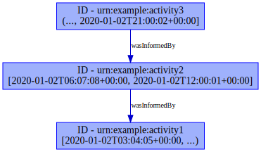
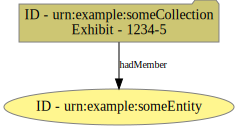
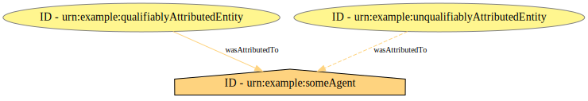

# CASE Implementation: PROV-O

This repository maps [CASE](https://caseontology.org/) to [W3C PROV-O](https://www.w3.org/TR/prov-o/).  Note that contrary to other CASE implementations, this maps CASE out to another data model, instead of mapping another data model or tool into CASE.


## Disclaimer

Participation by NIST in the creation of the documentation of mentioned software is not intended to imply a recommendation or endorsement by the National Institute of Standards and Technology, nor is it intended to imply that any specific software is necessarily the best available for the purpose.


## Usage

This software currently does not install.

The [tests](tests/) directory demonstrates the two standalone scripts run against CASE example JSON-LD data.
* `case_prov_rdf` - This script takes as input one or more CASE graph files, and outputs a graph file that adds annotations to the CASE nodes that serve as a standalone PROV-O graph.
* `case_prov_dot` - This script takes as input one or more PROV-O graph files, and outputs a Dot render.

On using `case_prov_rdf.py` to create a PROV-O graph, it is possible to provide that graph to a PROV-O consumer, such as a [PROV-CONSTRAINTS](https://www.w3.org/TR/prov-constraints/) validator.  This CASE project runs a Python package listed on the [W3C 2013 implementations report](https://www.w3.org/TR/2013/NOTE-prov-implementations-20130430/), [`prov-check`](https://github.com/pgroth/prov-check), as part of its sample output.  For instance, the [CASE-Examples repository](https://github.com/casework/CASE-Examples) is analyzed [here](tests/CASE-Examples/examples/prov-constraints.log).


### Running

All of the demonstration rendering (to PROV-O and to SVG images) can be run by cloning this repository and running (optionally with `-j`):

```bash
make
```

Be aware that some resources will be downloaded, including [Git submodules](.gitmodules), a Java tool used by the CASE community to normalize Turtle-formatted data, and PyPI packages.  External resources not from PyPI are versioned as Git records.  PyPI packages, [listed](tests/requirements.txt) in the tests directory, are purposefully imported at up-to-date versions instead of locking a specified version.


## Development status

This repository follows [CASE community guidance on describing development status](https://caseontology.org/resources/github_policies.html#development-statuses), by adherence to noted support requirements.

The status of this repository is:

4 - Beta


## Versioning

This project follows [SEMVER 2.0.0](https://semver.org/) where versions are declared.


## Ontology versions supported

This repository supports the CASE and UCO ontology versions that are distributed with the [CASE-Utilities-Python repository](https://github.com/casework/CASE-Utilities-Python), at the newest version below a ceiling-pin in [setup.cfg](setup.cfg).  Currently, those ontology versions are:

* CASE 0.7.0
* UCO 0.9.0


## Repository locations

This repository is available at the following locations:
* [https://github.com/casework/CASE-Implementation-PROV-O](https://github.com/casework/CASE-Implementation-PROV-O)
* [https://github.com/usnistgov/CASE-Implementation-PROV-O](https://github.com/usnistgov/CASE-Implementation-PROV-O) (a mirror)

Releases and issue tracking will be handled at the [casework location](https://github.com/casework/CASE-Implementation-PROV-O).


## Make targets

Some `make` targets are defined for this repository:
* `all` - Build PROV-O mapping files based on CASE examples, and generate figures.
  - **Non-Python dependency** - Figures require [`dot`](https://graphviz.org/) be installed.
* `check` - Run unit tests.
* `clean` - Remove built files.
* `distclean` - Also remove test-installation artifacts.

Note that the `all` and `check` targets will trigger a download of a Java content normalizer, to apply the ontology process described in [CASE's normalization procedures](https://github.com/casework/CASE/blob/master/NORMALIZING.md).


## Design notes

This repository maps CASE to PROV-O by the use of SPARQL `CONSTRUCT` queries, listed [here](case_prov/queries/).

Both direct relationships and qualified relationships are implemented, according to data tied to CASE `InvestigativeAction`s.  For example, [the `CONSTRUCT` query for `prov:actedOnBehalfOf`](case_prov/queries/construct-actedOnBehalfOf.sparql)) directly relates an action's instrument as a delegated agent of the action's performer.  This is built as a qualified, annotatable relationship with [the `CONSTRUCT` query for `prov:Delegation`](case_prov/queries/construct-Delegation.sparql)).

One CASE practice that might look non-obvious in the PROV context is CASE's representation of an initial evidence submission.  CASE represents this by an `InvestigativeAction` that has no inputs.  For a simplification of chain of custody querying, this project represents this as actions that use, and entities that are derived from, the empty set, `prov:EmptyCollection`.  (This is implemented in [this query](case_prov/queries/construct-used-nothing.sparql)).


## Visual-design notes

Some of the tests include small galleries of figures that are tracked as documentation.  Other figures can be generated by an interested user, but are not version-controlled at the moment.

See for example:
* [The CASE website narrative "Urgent Evidence"](tests/casework.github.io/examples/urgent_evidence/)

The following notes describe visual-design decisions.


### Visual-design credits

The `case_prov_dot` module adopts the design vocabulary used by Trung Dong Huynh's MIT-licensed Python project [`prov`](https://github.com/trungdong/prov).  `prov`'s [short tutorial landing page](https://trungdong.github.io/prov-python-short-tutorial.html) illustrates the shape and color selections for various nodes, edges, and annotations.  The `case_prov_dot` program uses this instead of the W3C's design vocabulary, illustrated in [Figure 1 of the PROV-O documentation page](https://www.w3.org/TR/prov-o/#starting-points-figure), because of the greater color specificity used for the various between-node-class edges.

The version of `prov` that `case_prov_dot` draws its designs from is tracked as a Git submodule.  This tracking is not for any purpose of importing code.  The [`prov.dot` package](https://github.com/trungdong/prov/blob/2.0.0/src/prov/dot.py) is imported as a library for its styling dictionaries, though this CASE project implements its own dot-formatted render to implement some extending design decisions, some of which are specific to CASE concepts.

[Conventions provided by the W3C](https://www.w3.org/2011/prov/wiki/Diagrams) were found after initial design of this section.  Color selection has not been compared, but directional flow has been adopted.  Notably, **time flows from up to down**, and when compared, **left to right**.  *(Note, though, that left-to-right temporal flow is not yet implemented.)*


### Departures from original visual-design vocabularies


#### Activity-activity edges

Both the illustration in W3C PROV-O's Figure 1, and the edge colors in the `prov` project, assign black to both `wasInformedBy` and `wasDerivedFrom`.  This CASE project opts to distinguish `wasInformedBy` by coloring its edges a shade of blue.


#### Activity labels

Activity labels in this CASE project include the activity's time interval, using closed interval notation for recorded times, and an open interval end with ellipsis for absent times.




#### Provenance records as collections

A `prov:Collection` is a subclass of a `prov:Entity`.  To distinguish `prov:Collection`s that are CASE `investigation:ProvenanceRecord`s, versus other `prov:Entity`s, a slightly different yellow is used, as well as a different shape.

The label form is also adjusted to include a CASE `exhibitNumber`, when present.




#### Edge weights

The PROV-O model provides direct-relationship predicates, and qualified relationships that *imply* the same direct structure but instead use an annotatable qualification object.  This CASE project illustrates PROV-O direct relationships, but makes one difference from the original `prov` visual-design vocabulary, using edge representation to represent relationship qualifiability.

Take for example this graph, which presents a shortened illustration from the [`prov:Attribution` example](https://www.w3.org/TR/prov-o/#Attribution):

```turtle
@prefix prov: <http://www.w3.org/ns/prov#> .

<urn:example:someAgent> a prov:Agent .

<urn:example:someEntity>
  a prov:Entity ;
  prov:wasAttributedTo <urn:example:someAgent> ;
  prov:qualifiedAttribution <urn:example:someAttribution> ;
  .

<urn:example:someAttribution>
  a prov:Attribution ;
  prov:agent <urn:example:someAgent> ;
  .
```

The direct relationship in this graph between `someEntity` and `someAgent` can be expressed in one statement:

```turtle
<urn:example:someEntity> prov:wasAttributedTo <urn:example:someAgent> .
```

The qualified relationship between `someEntity` and `someAgent` requires a path through two statements to link the two together:

```turtle
<urn:example:someEntity> prov:qualifiedAttribution <urn:example:someAttribution> .
<urn:example:someAttribution> prov:agent <urn:example:someAgent> .
```

The `prov:wasAttributedTo` predicate can be mechanically derived, by running a `CONSTRUCT` query that builds the predicate from the path `?nEntity prov:qualifiedAttribution/prov:agent ?nAgent`.  Since the `Attribution` object can also be further annotated in analysis, this project considers creation of an `Attribution` a stronger mapping of object relationships in CASE to PROV-O.

On the other hand, there may be times when the CASE mapping into PROV-O can provide the direct relationship, but not the qualified relationship.  This project considers this a weaker mapping of an object relationship in CASE to PROV-O, but still worth illustrating.

To illustrate the difference in projective capability of the subject CASE instance data, a solid line is used to represent when a qualified relationship was constructed from the CASE instance data.  A dashed line is used to represent when a direct relationship was constructed, but the qualified relationship could not be constructed.  This figure presents a variant on the above example, with the source data in [`readme-attribution.ttl`](figures/readme-attribution.ttl):



## Licensing

This repository is licensed under the Apache 2.0 License.  See [LICENSE](LICENSE).

Portions of this repository contributed by NIST are governed by the [NIST Software Licensing Statement](THIRD_PARTY_LICENSES.md#nist-software-licensing-statement).
